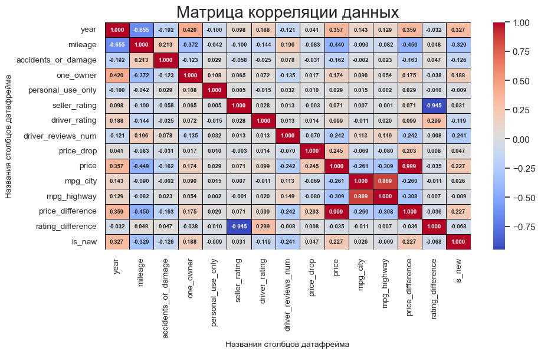

# Science
В рамках университета выполнен НИРС по теме "Продажа Б\У автомобилей" дисциплины "Оперативный анализ данных" 

# Описание датасета "Used Cars Dataset"

Этот набор данных содержит данные о 762 091 подержанном автомобиле, собранном из cars.com . Данные были собраны в апреле 2023 года.

## Цели:

1) Определение данных;
2) Формулирование гипотез;
3) Загрузка данных в Python;
4) Проверка данных;
5) Очистка данных;
6) Преобразование данных;
7) Выбор данных для анализа;
8) Агрегирование данных;
9) Визуализация данных;
10) Подтверждение или опровержение поставленных гипотез;
11) Формулирование ограничений и выводов.


## Определение данных для анализа:

В качестве данных для анализа был выбран датасет «Used Cars Dataset». В датасете представлены все данные о 762 091 подержанном автомобиле, собранном из [сайта](cars.com). Данные были собраны в апреле 2023 года.

Для анализа будем чаще всего использовать следующие данные из датасета: ...

# Описание данных

##### Содержимое в датасете

- `manufacturer`- название производителя автомобиля
- `model`- название модели автомобиля
- `year`- год, когда был выпущен автомобиль
- `mileage`- миль, пройденных автомобилем с момента выпуска
- `engine`- автомобильный двигатель
- `transmission`- тип трансмиссии автомобиля
- `drivetrain`- тип трансмиссии автомобиля
- `fuel_type`- тип топлива, которое потребляет автомобиль
- `mpg`- количество миль, которое автомобиль может проехать, используя один галлон топлива (мили на галлон)
- `exterior_color` - цвет кузова автомобиля
- `interior_color` - цвет салона автомобиля
- `accidents_or_damage` - попадал ли автомобиль в АВАРИИ
- `one_owner` - принадлежал ли автомобиль одному лицу
- `personal_use_only` - использовался ли автомобиль только в личных целях
- `seller_name` - имя продавца
- `seller_rating` - рейтинг продавца
- `driver_rating` - рейтинг автомобиля, данный водителями
- `driver_reviews_num` - количество отзывов об автомобилях, оставленных водителями
- `price_drop` - снижение цены по сравнению с начальной ценой
- `price` - цена автомобиля


# Подготовка и анализ данных

Мы изучили и ознакомили с размером датасета. Оптимизировал датасет:
- Объем датасета до преобразования: `561.306 Мбайт`
- Объем датасета после преобразования: `525.694 Мбайт`

Не так уж много сэкономили память - **6.34%**.

Рассмотрели описательную статистику:

Здесь стоит обратить внимание на следующие колонки:
- **Год**. Мы чаще всего можем увидеть автомобиль, которая продается около `2017 года` (среднее значение преобладает остальных). В объявлениях можем увидеть автомобиль с `1915 года`. 
- **Пройденный миль**. В объявлениях чаще всего выставляют автомобиль с `5.58^4 милях`. Нелья не отрицать, что в продажах выставляют автомобиль, которая ни разу не проехала. Существует автомобиль, которая проехала `1,11^6 миль`. 
- **Наличие авария автомобили**. Статистика говорит, что в объявлениях редко указывают, что автомобиль попадает в аварию. Мы можем сталкиваться с автомобилей, у которой была авария, с вероятностью около `22%`. 
- **Одно лицо у автомобилей**. Эта колонка говорит о том, что у этой автомобилей было только одно лицо - водитель. Если да, то одно лицо, в противном случае несколько лиц было у этой автомобили. Статистика говорит, что в среднем мы сталкиваемся с автомобилей, у которой было несколько лиц.
- **Пользование в личных целях**. Статистика говорит, что чаще всего пользуются автомобилей в личных целях, около `65%`.
- **Рейтинг продавца**. Продавец в среднем чаще всего выставляют автомобиль с рейтингом `4.15`, а самой минимальной - `1.00`.
- **Рейтинг водителя**. Водитель в среднем чаще всего выставляют автомобиль с рейтингом `4.62`, а самой минимальной - `1.00`.
- **Количество отзывов об автомобилях, оставленных водителями**. Водитель в среднем чаще всего выставляют автомобиль с рейтингом `4.62`, а самой минимальной - `1.00`.
- **Снижение цены по сравнению с начальной ценой**. В среднем мы можем увидеть в объявлениях, что продают автомобилей с `1007 долларов`, а самой максимальной - `170995 долларов`, минимальной - `100 долларов`.
- **Цена автомобиля**. В среднем мы можем увидеть в объявлениях, что продают автомобилей с `3.64^4 долларов`, а самой максимальной - `10 00 000 000 долларов`, минимальной - `1 долларов`. Интересно узнать, какие же автомобили же.

### Основываясь на это, можем сделать промежуточный вывод:

В датасете содержатся широкий диапазон промежутков года автомобилей, начиная с 1915 по 2024 года. Нельзя не отрицать, что в объявлениях выставляют продажи раритетных автомобилей, что было обусловлено высокой стоимостью. Также в объявлениях вытавляют автомобилей с большими пробегами, которая нуждается в технических ремонтах, не говоря уж о несколько лиц у этой автомобилей. Скорее всего в объвлениях выставляют служебные автомобили: фургоны, пикапы, т.к. процент пользования в личных целях невысок (около 65%). Самое удивительное, что продавцы оставили отзыв автомобиля ниже по сравнению с отзывом водителей. Поэтому отсюда следует причина - сильное понижение цены по сравнению с начальной стоимостью автомобилей.

# Предобработка данных

Разделили колонку `mpg` скорости автомобиля на городску и автомагистральную среду как:

```python
df['mpg'].value_counts()
```
```output
19-26      16210
18-25      15751
17-25      14304
20-27      13546
16-23      11489
           ...  
14-10.1        1
18-13          1
22-0.0         1
18-25.5        1
31-36.0        1
Name: mpg, Length: 865, dtype: int64
```

```python
# Разделение диапазонов mpg на две колонки
df[['mpg_city', 'mpg_highway']] = df['mpg'].str.split('-', expand=True)

# Преобразование колонок в числовой формат
# Флаг 'errors='coerce'' позволит обработать случаи, 
# когда значения не могут быть преобразованы в числа, и они будут заменены на NaN, если такие случаи есть.
df['mpg_city'] = pd.to_numeric(df['mpg_city'], errors='coerce')
df['mpg_highway'] = pd.to_numeric(df['mpg_highway'], errors='coerce')

# Удаление исходного столбца 'mpg', если нужно
df.drop('mpg', axis=1, inplace=True)
```


 Преобразовали цветов автомобилей
 ```python
 # Подберем список слов цветов для замены
selected_colors = ['black', 'white', 'gray', 'silver', 'red', 'green', 
                   'yellow', 'blue', 'orange', 'purple', 'brown', 'pink', 'beige', 'cyan', 'olive', 'maroon', 'navy', 'teal']

# Заменяет значения в столбце 'exterior_color' на основе ключевых слов.
def replace_keywords(df, col_name, selected_colors):
    
    # Приведение к нижнему регистру
    df[col_name] = df[col_name].str.lower()
    
    # Замена значений на основе частичного совпадения
    for color in selected_colors:
        mask = df[col_name].notna() & df[col_name].str.contains(color, case=False, na=False)
        df.loc[mask, col_name] = color

    return df

# Замена значений на основе ключевых слов
df = replace_keywords(df, 'exterior_color', selected_colors)
df = replace_keywords(df, 'interior_color', selected_colors)
 ```

Ознакомились с пропущенными значениями и дубликатов. Присутствуют наличия их. Также был обнаружен и устранен выброс по стоимостей автомобиля.

# Агрегирование данных и группировка

Мы сделали 2 агрегацию: `разница в продажах` и `разница в рейтингах, оставленных водителями и продавцами` 

##### Разница в продажах

Рассмотрим разницу в продажах, следуя по формуле:

$$ X_{\text{price difference}} = Y_{\text{price}} - Y_{\text{price drop}} $$

##### Разница в рейтингах, оставленных водителями и продавцами

Рассмотрим разницу в рейтингах, следуя по формуле:

$$ X_{\text{rating difference}} = Y_{\text{driver rating}} - Y_{\text{seller rating}} $$

##### Количество выпускаемых моделей производителями

```python
print('Список производителей в датасете:')
for name in df['manufacturer'].unique():
    print(name, end='; ')
```
```text
Список производителей в датасете:
Acura; Audi; BMW; Buick; Cadillac; Chevrolet; Chrysler; Dodge; Ford; GMC; Honda; Hyundai; INFINITI; Jaguar; Jeep; Kia; Land Rover; Lexus; Lincoln; Mazda; Mercedes-Benz; Mitsubishi; Nissan; Porsche; RAM; Subaru; Toyota; Volkswagen; Volvo; 
```

```python
# Группируем данные и подсчитываем частоту для каждого производителя
car_models_by_manufacturer = df.groupby(by='manufacturer').count()['model'].sort_values(ascending=True)

# Создаем график
plt.figure(figsize=(12, 8))
plt.barh(car_models_by_manufacturer.index, car_models_by_manufacturer.values)
plt.xlabel('Частота')
plt.ylabel('Производитель')
plt.title('Количество производимых автомобилей по производителям')
plt.xticks(rotation=90)
plt.tight_layout()

# Количество выпускаемых автомобилей
for index, value in enumerate(car_models_by_manufacturer.values):
    plt.text(value, index, str(value), ha='left', va='center')

# Отображаем график
plt.show()
```


# Анализ данных и проверка гипотез

#### Рассмотрели следующие гипотезы:

- **Влияние характеристик на цену автомобиля:**
    - Гипотеза: Автомобили с более низким пробегом имеют более высокую цену.
    - Гипотеза: Автомобили с более новыми годами выпуска стоят дороже.
    - Гипотеза: Рейтинг продавца и рейтинг водителей связаны с ценой автомобиля.
    
- **Сравнение внешнего и внутреннего цвета с ценой:**
	- Гипотеза: Автомобили с определенными цветами кузова и салона стоят дороже.

- **Исследование взаимосвязей между рейтингами продавца и водителей:**
	- Гипотеза: Рейтинг продавца коррелирует с рейтингом автомобиля, данным водителями.
  
- **Анализ изменения цен по годам:**
	- Гипотеза: Средняя цена на автомобили меняется с течением времени.

- **Влияние типа топлива и трансмиссии на эффективность топливопотребления (mpg):**
	- Гипотеза: Автомобили с определенным типом топлива имеют более высокую эффективность топливопотребления.
	- Гипотеза: Автомобили с определенным типом трансмиссии имеют более высокую эффективность топливопотребления.

# Корреляционная матрица тепловой карты

 ```python
 plt.figure(figsize=(10, 5))

# Построение тепловой карты корреляции
heatmap = sb.heatmap(
    df.corr().round(3), 
    annot=True, 
    cmap='coolwarm', 
    fmt='.3f', 
    annot_kws={"size": 7, "weight": "bold"}, 
    linewidths=.5,
    linecolor='black');

# Применение настроек шрифта
plt.xticks(fontsize=10)
plt.yticks(fontsize=10)

heatmap.set_ylabel('Названия столбцов датафрейма', fontdict={'size': 10})
heatmap.set_xlabel('Названия столбцов датафрейма', fontdict={'size': 10})

# Добавление заголовка
plt.title('Матрица корреляции данных', fontdict={'size': 20});

plt.show()
```


Давайте условно назовем сильную корреляцию, когда значение превышает `0.5` / `-0.5`. 

Здесь в большинствах случаях корреляция равна нулю или слабо положительная / отрицательная.

Есть то, что стоит обратить внимание на очевидные вещи:

- **Год выпуска и Пробег:** Присутствует средняя отрицательная корреляция между годом выпуска автомобиля и его пробегом, что логично, так как новые автомобили обычно имеют меньший пробег.

- **Год выпуска и Цена:** Наблюдается положительная корреляция между годом выпуска и ценой. Это также ожидаемо, поскольку новые автомобили, как правило, дороже.

- **Пробег и Цена:** Существует отрицательная корреляция между пробегом и ценой, что подтверждает интуитивное представление: чем меньше пробег, тем выше цена.

- **Оценка продавца и Цена:** Отмечается слабая положительная корреляция между оценкой продавца и ценой. Такие автомобили, вероятно, более дорогие.

- **Оценка водителя и Цена:** Слабая положительная корреляция между оценкой водителя и ценой. Автомобили с более высокими оценками водителей, вероятно, также более дорогие.

- **Число отзывов водителей и Цена:** Отсутствует значительная корреляция между числом отзывов водителей и ценой.

- **Рейтинг продавца и Рейтинг водителя:** Существует слабая положительная корреляция между рейтингами продавца и водителя. Это может свидетельствовать о том, что продавцы и водители оценивают автомобили схожим образом.

- **Разница в рейтинге и Цена:** Отсутствует значительная корреляция между разницей в рейтинге и ценой.

- **Новизна автомобиля и Цена:** Присутствует положительная корреляция между новизной автомобиля и его ценой.


# Итог

#### Предобработка данных

Перед анализом было оптимизированно использование памяти путем преобразования данных к более корректным типам. Также были добавлены необходимые столбцы при помощи агрегирования данных, что в дальнейшем нам облегчили провести исследование и подтвердить гипотезу, а также получить ценные знания в предметной области «Used Cars Dataset».

#### В ходе анализа гипотез было выявлено:

- Самый дешевый автомобиль будет только тогда, когда у него пробег большой;

- Есть вероятность того, что автомобиль с новым выпуском будет стоить дешевле.

- Не исключено, что продавец и покупатель, оставленные высокий рейтинг автомобиля, будут продавать дороже.

- Самый распространенный цвет кузова автомобиля ¬– черный, белый и желтый. Менее популярный – серебристый, красный и бордовый.

- Самый распространенный цвет салона автомобиля ¬– красный, черный и коричневый. Менее популярный – серый, бежевый и оливковый.

- Есть слабая положительная корреляция между оценками водителей и продавцами.

- Средняя цена автомобиля меняется в течение года его выпуска.

- Существует и самый предпочитаемый тип топлива – бензин, энергоэффективность которого превосходит другого.

- Автомобиль с автоматической коробкой переключении передачи расходует намного меньше топлива по отношению к автомобилям, у которых механическая коробка переключения передачи.


